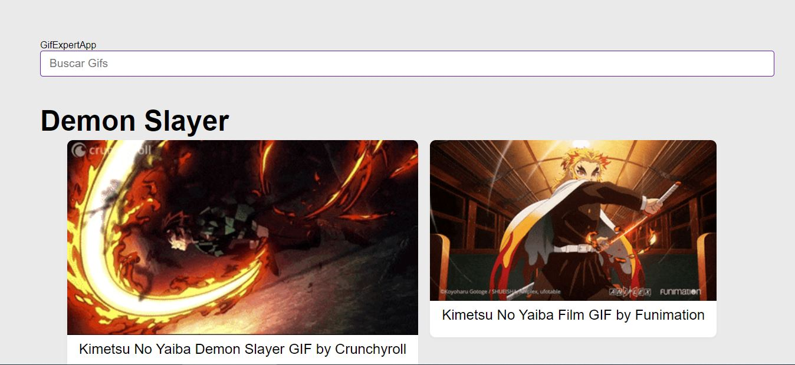
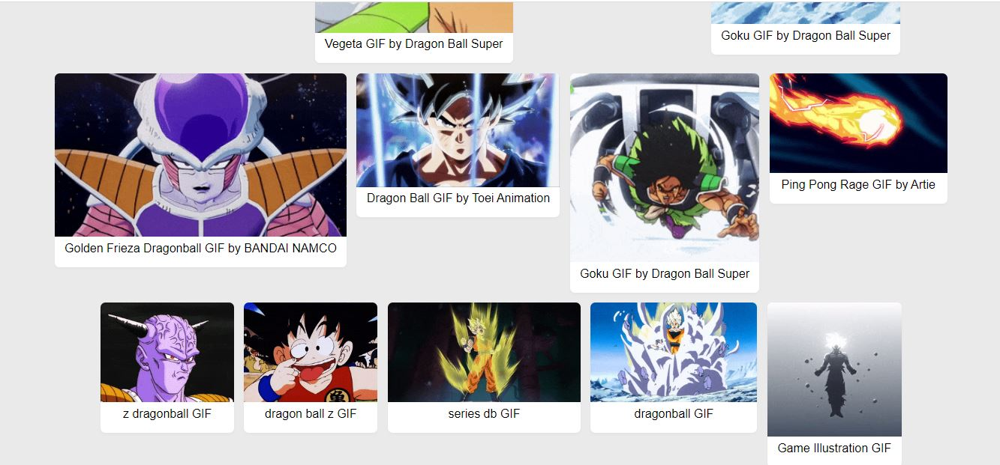
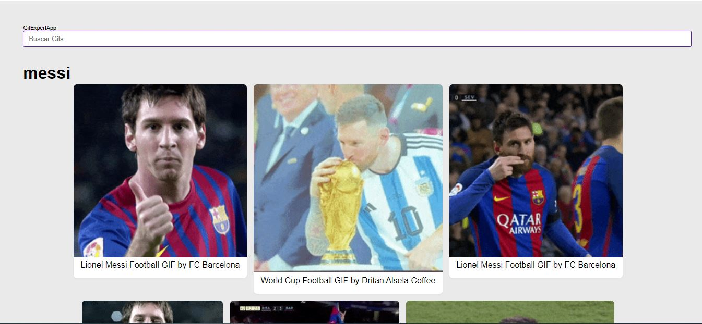

# React gif expert app - Practicing React.
-Website [React gif expert app](https://gif-expert-app-juanpa88842.netlify.app/)

## Table of contents

- [Overview](#overview)
  - [The challenge](#the-challenge)
  - [Screenshot](#screenshot)
- [My process](#my-process)
  - [Built with](#built-with)
  - [What I learned](#what-i-learned)
- [Author](#author)

## Overview

### The challenge

Build an application that allows me to make requests to an API (https://giphy.com/) and display the results on the screen as GIFs.

### Screenshot

## My process
The project started with the main page, creating a search bar for GIFs. Then, a list of results was built as you typed into the search bar and sent the entered data. Everything was divided into reusable components, each with a single purpose. Later, the API call was initiated, and styling was applied to display the results on the screen.

### Built with

- React.js
- [animate.css](https://animate.style/) - CSS library
- [Bootstrap 5.3v](https://getbootstrap.com/) - CSS library
- [Netlify](https://gif-expert-app-juanpa88842.netlify.app/) - Deployed

### What I learned

This application was quite straightforward; however, I learned some of the fundamental topics of React through this practice. Some of them include:

- Making a fetch request to an external API
- Custom Hooks
- Communication between components
- Animations
- Passing methods as arguments
- Creating lists
- Keys
- CSS classes

## Author

- LinkedIn - [Juan Pablo Cuartas](https://www.your-site.com)
- Email - [juanpa88842@gmail.com](https://www.linkedin.com/in/juanpablocuartas/)
- (https://gif-expert-app-juanpa88842.netlify.app/)
